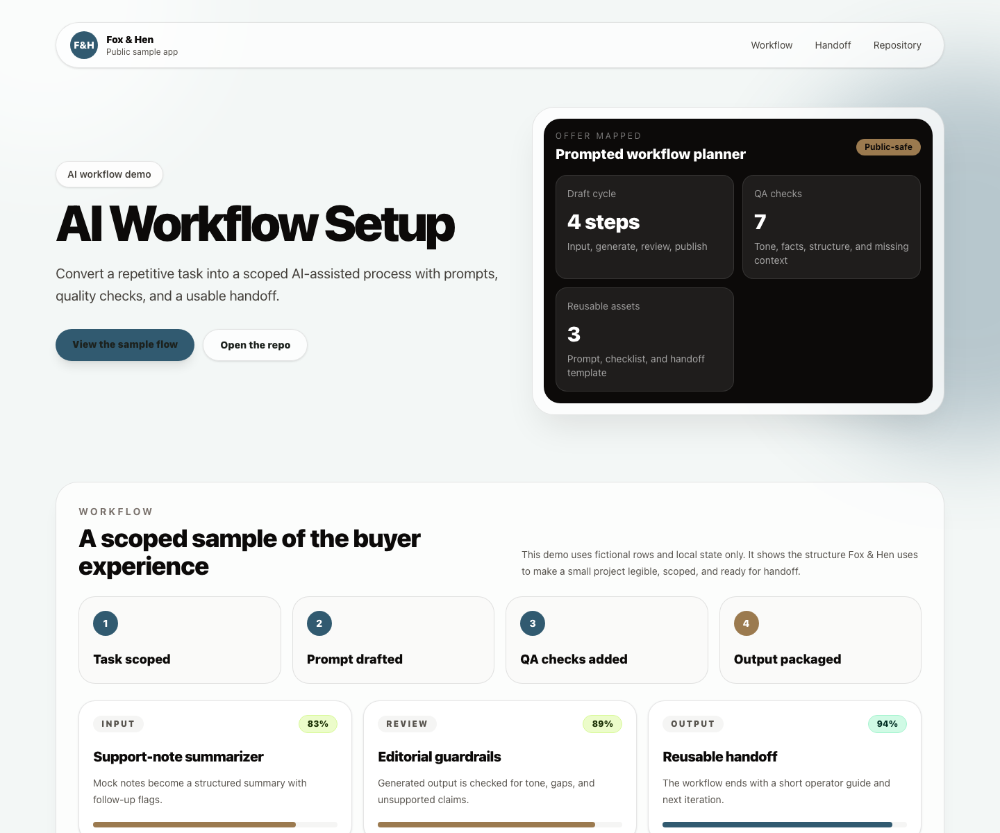

# AI Workflow Setup Studio

A portfolio-grade public sample app for a practical AI workflow setup offer. The demo behaves like a small product: fictional intake notes are transformed into a reusable workflow kit with prompt assets, weighted QA checks, failure modes, operator notes, and an iteration plan.

## Service Mapping

- Offer: Practical AI workflow setup
- Proof point: Intake-to-workflow builder with local sample data
- Live demo: https://foxhen-ai-workflow-setup.vercel.app
- Repository: https://github.com/foxandhenllc/foxhen-ai-workflow-setup

| Service moment | Demo artifact | Buyer takeaway |
| --- | --- | --- |
| Discovery | Fictional intake queue and generated job card | Shows how rough repeatable work becomes a scoped workflow. |
| Build | Prompt assets, workflow steps, and package tabs | Demonstrates reusable assets instead of one-off prompt writing. |
| Review | Weighted QA checks, strict mode, and failure modes | Keeps AI assistance bounded by human review and risk notes. |
| Handoff | Operator notes, iteration plan, and simulated export state | Gives a forkable shape for training and future improvements. |

## Screenshot



## What This Demonstrates

- A premium React/Vite/TypeScript interface for a fixed-scope service.
- Meaningful local interactivity without a server, accounts, third-party calls, or environment variables.
- Fictional intake examples that become a structured job card, prompt bundle, QA matrix, and handoff package.
- Clear buyer-facing value: scope the repeatable task, build the AI-assisted step, evaluate risk, and package the operating guide.

## Interactions To Test

1. Pick each fictional intake item in the workflow builder and watch the generated job card update.
2. Toggle strict review mode to change the workflow confidence score.
3. Review the weighted QA checks and failure-mode mitigations.
4. Switch the output package tabs: Workflow, Prompts, QA, and Handoff.
5. Use the simulated copy/export buttons to see local UI state respond.

## Local Run

```bash
npm install --package-lock=false
npm run dev
```

## Build

```bash
npm run build
```

## Scope Note

This repository is a public sample app. It uses local static fictional data only and does not require credentials, accounts, payments, databases, third-party services, environment variables, or production access.

## Forking Notes

- Customize `src/data/sample.ts` first; all intake notes, prompts, checks, and handoff copy are typed local data.
- Keep examples fictional or anonymized, and avoid real customer notes, internal prompts, proprietary process docs, or production outputs.
- Update `repo`, `liveUrl`, service labels, and screenshots before using this as a public catalog sample.
- Do not add API calls, model keys, forms, auth, analytics, or external automation unless a fork explicitly documents that new scope.
